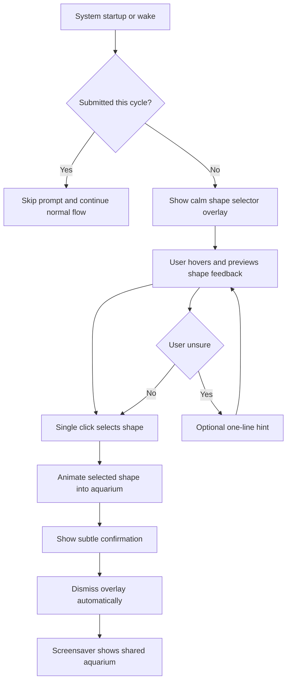
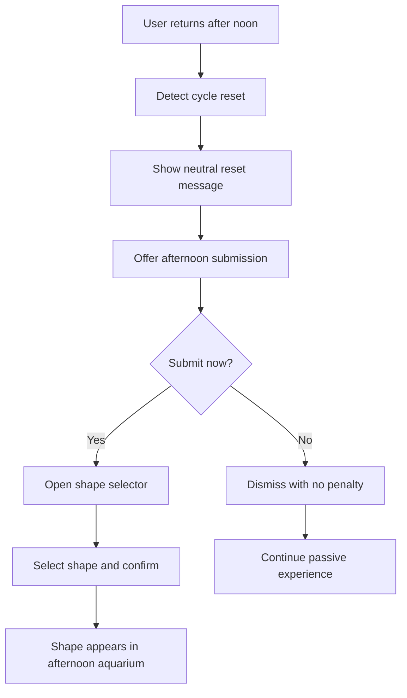
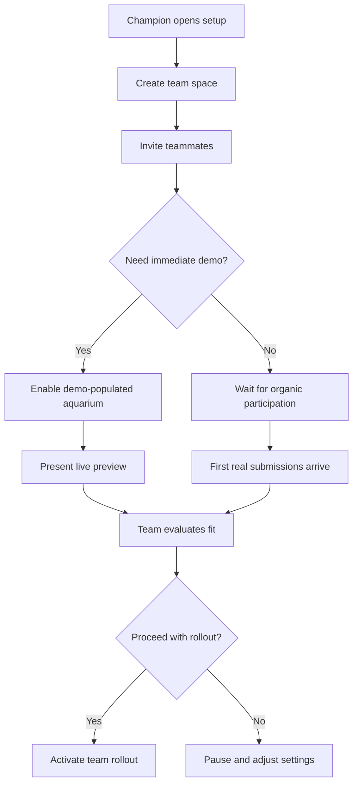

# UX Design Specification bmad_test

**Author:** astan
**Date:** 2026-04-28

---

<!-- UX design content will be appended sequentially through collaborative workflow steps -->

## Executive Summary

### Project Vision

Emotional Aquarium is a cross-platform desktop screensaver application for workplace teams. Each day, users select a 3D shape representing a positive personal affirmation — hope, curiosity, happiness, love, or luck. That shape seamlessly joins a shared, gently animated aquarium visible to all teammates in real time. The experience is anonymous, passive, and non-intrusive: no names, no prompts, no management dashboards. It creates *ambient emotional presence* — a way for people to feel connected to colleagues without requiring conversation, vulnerability, or performance.

### Target Users

**Primary Users**
- **Everyday Knowledge Worker (Maya archetype):** Works in a fast-paced, emotionally flattened environment. Wants a low-friction, aesthetically rewarding moment of human connection in the workday.
- **Distracted / Late User (Jonas archetype):** Low engagement window; needs the submission flow to be instantly obvious with zero learning curve. Sensitive to failure states feeling anxious or technical.

**Secondary Users**
- **Team Lead (Elena archetype):** Participates as a peer, not a manager. Explicitly does not want inspector or dashboard mode. Values restraint and collective atmosphere.
- **Internal Champion (Nina archetype):** Lightweight setup, demo mode, and compelling onboarding are essential so she can pitch and roll out the product without IT support.
- **Informal Support Person (Aron archetype):** Needs the product to self-explain its own behavior (noon reset, sync delays, submission confirmation) to keep support overhead near zero.

### Key Design Challenges

1. **Zero-friction submission flow:** The daily shape selection must be completable in under 30 seconds with zero prior training. First-time users must understand the affirmation vocabulary and interaction immediately.
2. **Passive vs. active modes:** The screensaver is passive; the submission moment is active. The UX must transition between these two modes without confusion or interruption.
3. **Graceful failure states:** Missed submissions, delayed syncs, and noon resets must feel calm, self-explanatory, and non-alarming. No state should feel broken or require escalation.
4. **Demo mode believability:** The internal champion needs a demo that feels as rich and alive as a real populated aquarium — without waiting for organic participation.
5. **Cross-platform consistency:** macOS and Windows must feel identical in animation quality, timing, and interaction behavior.

### Design Opportunities

1. **Emotional resonance through restraint:** The minimal retro aesthetic is a feature, not a limitation. Great UX leans into calm, beauty, and simplicity as differentiators from cluttered workplace tools.
2. **Ritual design:** The noon reset creates two natural renewal moments. UX can reinforce this rhythm as a positive, intentional feature rather than hiding it.
3. **Collective visibility as reward:** Seeing your shape in the aquarium alongside others is the payoff moment. UX should make this moment feel meaningful — the "I am not alone" emotion should be tangible.

## Core User Experience

### Defining Experience

Emotional Aquarium centers on two complementary modes: an **active submission ritual** and a **passive shared display**. The primary value moment is not the submission itself but the *reward* — seeing your anonymous shape floating alongside your teammates' in the shared aquarium. Every UX decision must protect this sequence: low-friction entry → beautiful collective payoff.

### Platform Strategy

- **Primary platform:** Desktop application for macOS and Windows (MVP parity required)
- **Interaction model:** Mouse/keyboard; no touch input required at MVP
- **Activation modes:** Screensaver (system idle trigger) and direct launch
- **Connectivity:** Real-time sync required for aquarium state; graceful degradation messaging for sync delays
- **No mobile or web at MVP** — web-based fallback is a post-MVP growth feature

### Effortless Interactions

- **Affirmation selection:** Single interaction, no prior explanation needed. The affirmation vocabulary (hope, curiosity, happiness, love, luck) and shape mapping must be immediately legible from visual design alone.
- **Aquarium activation:** Zero user action. The screensaver launches on system idle and displays the current collective state automatically.
- **Noon reset:** Fully automatic. The transition to a new cycle must feel intentional and calm — never like an error.
- **Demo mode:** Simulates a fully populated aquarium with a single trigger — no real participants required.

### Critical Success Moments

1. **First submission (< 30 seconds):** The user opens the shape selector, immediately understands all options, makes a choice, and receives clear confirmation. No help text needed.
2. **First aquarium view:** The user sees their shape floating among others. The visual quality, animation smoothness, and collective density create the "I am not alone" emotional response.
3. **Demo moment:** A new viewer sees the populated aquarium for the first time and immediately understands both *what it is* and *why they want it* — without explanation.
4. **Graceful miss:** A user who misses the morning window encounters a calm, self-explanatory state (not an error) and can submit in the afternoon cycle without frustration.

### Experience Principles

1. **Passive over active:** The product should require as little user effort as possible. Defaults, automation, and calm behavior are always preferred over prompts, alerts, or choices.
2. **Beauty is function:** Visual quality and animation smoothness are not polish — they are core to the emotional value. A stuttering aquarium is a broken product.
3. **Anonymity as safety:** No identifying information, no rankings, no counts per person. The design must never accidentally create social pressure or surveillance.
4. **Ritual, not tool:** The product is a daily moment, not a utility. UX should reinforce its rhythm and warmth, not optimize for efficiency.
5. **Self-explanatory states:** Every system state (syncing, reset, empty, full) must be visually legible without error messages or help documentation.

## Desired Emotional Response

### Primary Emotional Goals

The central emotional promise of Emotional Aquarium is **belonging without pressure**. Users should feel quietly connected to their team — aware of shared human presence — without being asked to perform, report, or respond. The product's emotional contract is warmth through restraint.

**Primary:** Belonging — "I am part of something, and I am not alone."
**Secondary:** Calm — the experience should never feel urgent, alarming, or demanding.
**Secondary:** Quiet delight — the visual quality and collective effect should produce a small, genuine smile.

### Emotional Journey Mapping

| Moment | Target Emotion | Design Goal |
|---|---|---|
| First product discovery | Curiosity, intrigue | Visual immediately communicates "living, warm, collective" without explanation |
| Shape selection (morning) | Safety, ease | Zero ambiguity; the interaction feels private and low-stakes |
| Submission confirmation | Quiet satisfaction | Clear, calm confirmation: "your shape has joined the aquarium" |
| Aquarium view (screensaver) | Warmth, belonging | Collective density, gentle animation, and visual beauty produce the "I am not alone" moment |
| Missed submission | Unbothered | No guilt prompt, no streak counter — just a calm offer for the afternoon cycle |
| Noon reset | Gentle renewal | The reset feels like a fresh start, not a loss |
| Demo viewing (champion) | Immediate desire | "I want this for my team" — legible in seconds without explanation |

### Micro-Emotions

- **Belonging over isolation:** The aquarium must feel populated and alive even with a small team. Sparseness must be handled gracefully so it never feels empty or lonely.
- **Calm over excitement:** No celebratory animations, sound effects, or congratulatory moments. The tone is ambient and meditative.
- **Quiet delight over bold surprise:** Visual beauty and subtle animation reward attention without demanding it.
- **Trust over skepticism:** Anonymity must be legible from the design itself — users should feel confident without needing to read a privacy policy.
- **Inclusion over pressure:** Users who miss a day must never feel penalized, prompted, or counted. No streaks, no reminders, no shame.

### Design Implications

- **Belonging →** The aquarium must always display a collective view, never an individual's shape in isolation. Visual density governs perceived warmth.
- **Calm →** Animations are slow, smooth, and looping. No sudden transitions, no alerts, no badges. Color palette is muted and warm.
- **Safety →** Shape selection UI must reinforce privacy: no names visible, no "who chose what" — just the collective pool.
- **Trust →** Anonymity is communicated visually and passively. The product should never ask the user to trust it; the design itself demonstrates it.
- **Graceful failure →** All edge states (sync delay, empty aquarium, missed window) are shown as calm informational states, not errors. Language is warm, first-person, and non-alarming.

### Emotional Design Principles

1. **Never create anxiety.** Every system state, transition, and message should reduce cognitive load, not add it.
2. **Earn delight through quality.** The emotional payoff comes from visual and animation excellence, not from UI celebrations or gamification.
3. **Anonymity is the safety net.** If users ever feel exposed or traceable, the emotional contract is broken. Protect anonymity at every layer of the design.
4. **Absence is not failure.** The product must communicate that skipping a day, missing a cycle, or seeing a sparse aquarium is normal and okay.

## UX Pattern Analysis & Inspiration

### Inspiring Products Analysis

**Calm / Headspace (meditation apps)**
- Masterclass in ambient, non-demanding UX. Gentle onboarding, no pressure to engage, beautiful visuals that reward attention passively. Color palettes are muted and warm.
- Lesson: A product can be visually rich and emotionally resonant without requiring ongoing user effort.

**Spotify "Now Playing" / ambient music screensavers**
- The full-screen album art screensaver is a widely recognized pattern for turning passive display into aesthetic reward. No interaction required — beauty just appears.
- Lesson: Screensaver-mode UX earns trust by being visually high-quality and unobtrusive. Users accept passivity when the display is worth watching.

**Slack status emoji**
- The closest analogy to affirmation submission: a single, low-friction micro-interaction that signals presence without requiring conversation. Highly voluntary, anonymous in aggregate.
- Lesson: Workplace micro-expression works when it's fast, optional, and carries no social risk. But Slack status is individual and named — Emotional Aquarium improves on this by making it collective and anonymous.

**Monument Valley / Alto's Odyssey (mobile games)**
- Retro-inspired, minimal aesthetic combined with gentle 3D animation. These games demonstrate that "retro" doesn't mean cheap — it means geometric clarity, warm color grading, and satisfying motion curves.
- Lesson: The visual language of retro-minimal 3D is achievable at high quality and universally legible. Users don't need explanation to feel the aesthetic.

**Windows/macOS screensaver ecosystem (Aerial, Fliqlo)**
- Users who adopt premium screensavers are selecting for beauty and calm over utility. Aerial (Apple TV aerial footage) and Fliqlo (flip clock) succeed by being visually compelling on their own, even before any social layer.
- Lesson: The screensaver canvas has established user expectations around visual quality. Emotional Aquarium must meet or exceed this standard.

### Transferable UX Patterns

**From ambient apps:**
- Full-screen immersive display with zero chrome/UI visible during passive mode
- Graceful wake from screensaver with no jarring transitions
- Muted, warm color palettes that work in any lighting environment

**From micro-interaction tools (Slack status, Calendar emoji):**
- Single-tap/click selection with immediate visual confirmation
- Small vocabulary of choices (5 options) reduces cognitive load to near zero
- No undo required — selection is low-stakes and easily replaceable next cycle

**From collective visualization (real-time maps, live dashboards):**
- Visual density communicates participation level at a glance
- Shapes should be distributed organically, not in a rigid grid — organic placement reads as "alive"
- A loading/syncing state should feel like watching something grow, not waiting for data

**From onboarding patterns (Duolingo, Notion first-run):**
- First-time users need to see the aquarium populated immediately — use demo state on first run
- Affirmation vocabulary must be self-evident from the shape/icon design alone, without label tooltips

### Anti-Patterns to Avoid

- **Wellness survey UI (15Five, Officevibe):** Clinical, form-heavy, managerial tone. If Emotional Aquarium ever looks like a form, it has failed.
- **Gamification chrome (streaks, badges, progress bars):** Any counter or achievement mechanism introduces pressure and surveillance. Explicitly forbidden.
- **Named presence indicators (Teams/Zoom status dots):** Individual attribution destroys anonymity. The aquarium shows the collective, never the individual.
- **Alert/notification patterns:** No push notifications, no "don't forget to submit" reminders. Participation must always feel entirely voluntary.
- **Dashboard aesthetics (charts, percentages, counts):** Numbers reduce the aquarium to a metric. Visual form only — no quantification of the collective.

### Design Inspiration Strategy

**Adopt:**
- Full-screen passive display with zero visible UI chrome (from premium screensavers)
- Single-interaction shape selection with immediate visual feedback (from Slack status micro-pattern)
- Warm muted retro palette with geometric 3D forms (from Monument Valley / Alto's Odyssey)
- Demo/populated state on first run (from best-practice onboarding)

**Adapt:**
- Aerial-screensaver visual quality standard → applied to generative 3D shape animation rather than video
- Calm app's "non-demanding" activation model → adapted for screensaver idle trigger rather than app open

**Avoid:**
- Any UI pattern borrowed from wellness, HR, or analytics tools
- Any social pattern that exposes individual identity
- Any gamification or streak mechanic

## Design System Foundation

### Design System Choice

**Bespoke Minimal Design System** — a lightweight, purpose-built design language with no external component library dependency.

Emotional Aquarium has an unusually small active UI surface: the screensaver canvas is generative 3D and has no standard UI components; the interactive layer consists of fewer than six distinct screens/states. Adopting an established component system (Material Design, MUI, Ant Design) would introduce unnecessary abstraction, visual conventions that conflict with the retro-ambient aesthetic, and dependencies that add maintenance overhead without meaningful return.

Instead, the product requires a small, highly intentional set of design tokens and bespoke components that serve the aesthetic and emotional goals precisely.

### Rationale for Selection

- **Aesthetic control:** The retro-minimal visual language cannot be approximated through theming an existing system without significant effort. Custom tokens from the ground up are faster and more coherent.
- **Surface area is tiny:** The entire interactive UI fits in ~6 component types. A full component library is disproportionate to the need.
- **No generic UI patterns:** There are no data tables, complex forms, navigation bars, or dashboards. Standard component libraries optimise for these; Emotional Aquarium has none of them.
- **Animation is core:** Motion design is a primary product differentiator. Custom motion tokens and curves are required regardless of any library choice.

### Implementation Approach

Define and document the following design token categories:

| Token Category | Purpose |
|---|---|
| Color palette | Muted warm base + affirmation accent colors (one per shape type) |
| Typography | Single typeface, minimal scale (2–3 sizes max) |
| Motion | Easing curves, duration scale, looping animation principles |
| Spacing | Simple 4pt or 8pt grid |
| Elevation / depth | 3D layer depth conventions for shape rendering |

Custom components required (complete list):
1. **Shape selector card** — the primary submission UI
2. **Submission confirmation state** — post-selection feedback
3. **Aquarium canvas** — the screensaver frame and animation container
4. **First-run onboarding overlay** — demo mode and initial setup
5. **System status indicator** — sync state, noon reset, connection feedback
6. **Admin/setup panel** — lightweight team configuration (Nina's flow)

### Customization Strategy

All visual properties are defined as tokens — no hardcoded values in components. This allows:
- Seasonal or thematic aquarium variations in future without component rewrites
- Straightforward brand adaptation if the product is white-labeled
- Consistent motion feel across both macOS and Windows implementations despite different rendering stacks

## Core User Experience — Defining Interaction

### Defining Experience

> **"Choose your shape. Find yourself in the aquarium."**

Emotional Aquarium's defining interaction is a two-beat ritual: a brief, private moment of affirmation selection followed by a passive, collective visual reward. Neither beat works without the other — the submission is only meaningful because the aquarium exists; the aquarium is only personal because the user contributed to it.

This is the one interaction to get perfectly right. Every other UX decision flows from protecting and amplifying this sequence.

### User Mental Model

Users arrive with the mental model of **choosing a reaction** — a familiar, low-stakes micro-gesture from emoji pickers, reaction toolbars, and status selectors. The vocabulary is intentionally small (5 options) and positivity-constrained so the choice never feels risky or exposing.

The novel element users must internalize — ideally without explanation — is that their choice **joins a shared visual field** rather than being sent to a person or stored as a data point. This mental model shift (from "I am reporting" to "I am contributing to something collective") is the product's core insight, and the aquarium display is the moment it becomes tangible.

### Success Criteria

- **Speed:** Shape selected and confirmed in under 10 seconds for returning users; under 30 seconds for first-time users
- **Zero ambiguity:** Each affirmation shape is legible by visual design alone — no tooltip or label required to understand the choice
- **Immediate feedback:** The selected shape visually "enters" or "joins" the aquarium upon selection — not a generic checkmark or success toast
- **Presence confirmed:** When the screensaver activates, the user's shape is clearly visible among others — not lost or invisible in the collective
- **Anonymity preserved:** No visual or interactive path exists to identify which shape belongs to which team member

### Novel UX Patterns

The affirmation submission is built on a **familiar selection pattern** (choose one of N) applied to an **unfamiliar reward structure** (collective ambient visualization). This combination requires:

- **Self-teaching visual design:** The aquarium must communicate "this is where your shape goes" on first view, without onboarding copy
- **Demo-first strategy:** First-time users see a populated aquarium immediately (demo state) so the reward is demonstrated before participation is earned
- **Shape-as-identity metaphor:** The 3D shape must feel like a personal token — distinctive enough to feel like "mine" when seen in the aquarium, but not so distinctive it enables identification

### Experience Mechanics

**1. Initiation**
- System startup or screen wake triggers the submission prompt (if no submission this cycle)
- A calm, full-screen or prominent overlay appears — not a notification or tray pop-up
- No text instruction needed; the five shapes are immediately visible and selectable

**2. Interaction**
- User clicks or hovers a shape — it responds visually (scale, glow, or gentle float animation)
- Single click confirms the selection — no "submit" button required
- The shape animates into the aquarium canvas as confirmation

**3. Feedback**
- The selected shape visibly joins the aquarium — it "swims in" rather than a modal closing
- A minimal, wordless confirmation (e.g. gentle particle burst or ripple) signals success
- The submission overlay dissolves; the aquarium remains visible briefly before the screensaver activates

**4. Completion**
- The user's shape is present in the aquarium for the remainder of the cycle (until noon reset)
- No further action required — the screensaver takes over
- If the user looks at the screensaver later, their shape is findable (but not labeled)

## Visual Design Foundation

### Color System

**Design philosophy:** The color palette must work as a screensaver — meaning it must look beautiful in a dark, ambient context (screen saver mode) and read cleanly in a light application context (submission UI). The palette is warm, muted, and intentionally restrained.

**Base palette:**

| Role | Description | Usage |
|---|---|---|
| Background (dark) | Deep navy or near-black with warm undertone | Aquarium canvas, screensaver |
| Background (light) | Off-white or warm light grey | Submission UI overlay |
| Surface | Slightly elevated from background | Cards, panels |
| Text primary | Near-white (dark mode) / near-black (light mode) | Labels, body |
| Text secondary | Muted 60% opacity | Supportive text, hints |

**Affirmation accent colors — one per shape type:**

| Affirmation | Color tone | Character |
|---|---|---|
| Hope | Soft amber / warm gold | Optimistic, luminous |
| Curiosity | Electric teal / cyan | Alert, open |
| Happiness | Coral / warm orange | Warm, energetic |
| Love | Rose / dusty pink | Tender, soft |
| Luck | Sage green / muted jade | Grounded, gentle |

Accent colors must:
- Work as 3D shape material colors (lit surface + shadow variation)
- Remain distinguishable in the aquarium at small sizes
- Meet WCAG AA contrast against both dark and light backgrounds when used as labels

**Accessibility:** All text on background combinations meet WCAG AA (4.5:1 minimum). The product operates primarily as a screensaver (no text-critical reading), but submission UI must comply fully.

### Typography System

**Philosophy:** Typography is minimal and functional — the product is primarily visual, not textual. Typeface selection should reinforce the retro-minimal aesthetic: geometric, clean, slightly characterful.

**Recommended direction:** A single geometric sans-serif typeface (e.g. in the style of Futura, DM Sans, or Inter with geometric characteristics). Monospaced accents optional for system status states.

**Type scale (minimal — 3 sizes maximum):**

| Level | Size | Weight | Usage |
|---|---|---|---|
| Display | 24-28px | Light / Regular | Affirmation labels in selector |
| Body | 14-16px | Regular | Onboarding copy, status messages |
| Caption | 11-12px | Regular | System state indicators, timestamps |

**Principles:**
- No decorative or serif typefaces — the retro quality comes from geometry and color, not letterform ornamentation
- All type renders at high contrast — no grey-on-grey combinations
- Minimal copy throughout — the fewer words visible, the better

### Spacing & Layout Foundation

**Base unit:** 8px grid. All spacing values are multiples of 8 (or 4 for micro-spacing within components).

**Layout philosophy:** The product has two radically different layout contexts:
- **Screensaver canvas:** Full-screen, no chrome, no margins — the entire viewport is the aquarium
- **Submission UI:** A centered, constrained overlay — generous padding, single focal point, nothing competing for attention

**Submission UI layout principles:**
- Content width constrained to ~480px maximum — never spans full screen on large displays
- Vertical centering — the selector card lives in the middle of the screen
- Generous internal padding (32-48px) — the card must never feel cramped
- No competing elements — the five shapes are the only interactive content visible

**Aquarium canvas layout principles:**
- Shapes float freely across the full canvas — no grid, no alignment, organic distribution
- Shape sizes vary slightly (+/-20%) to create natural depth variation
- Edge avoidance: shapes drift away from screen edges to avoid clipping
- No UI chrome visible during screensaver playback — not even a clock or progress bar

### Accessibility Considerations

- **Color independence:** Affirmations are identified by shape geometry *and* color — users with color vision differences can distinguish options by form alone
- **Motion sensitivity:** The aquarium animation must respect system-level "reduce motion" preferences — shapes can remain visible but stationary if the preference is active
- **Contrast compliance:** All interactive UI elements meet WCAG AA; the screensaver canvas (non-interactive, ambient) is exempt from strict compliance but targets legibility
- **Font size:** Minimum 14px for all readable text; no critical information conveyed at caption size alone
- **Keyboard accessibility:** The submission selector must be fully keyboard-navigable (tab + enter/space) in addition to mouse

## Design Direction Decision

### Design Directions Explored

Six design directions were explored with consistent UX mechanics and varying visual emphasis:

1. Velvet Neon: high contrast, emotionally bold
2. Dusty Analog: retro soft, low stimulation
3. Calm Prism: balanced contrast, calm and legible
4. Mono Depth: ultra-minimal monochrome
5. Dawn Aquarium: brighter daytime-friendly palette
6. Playful Orbit: expressive and character-rich

### Chosen Direction

Direction 3, Calm Prism, selected as the primary baseline.

### Design Rationale

Calm Prism best supports the core emotional objective: belonging without pressure. It creates a low-stakes ritual that feels shared rather than performative, maintains shape legibility on typical office displays, and avoids visual patterns associated with surveillance or gamified productivity tools.

### Implementation Approach

1. Use Calm Prism as the default token set for MVP.
2. Apply Dusty Analog warmth only as constrained micro-accents (non-dominant backgrounds, contrast-safe).
3. Keep Playful Orbit as an opt-in seasonal variant pack, not the default.
4. Preserve semantic token architecture so alternate packs can be added without breaking core interaction behavior.
5. Explicit anti-gamification rule: no counters, streaks, rankings, or contribution leaderboards in the aquarium experience.

### Engineering Guardrails

1. Performance budget: target at least 45 FPS on baseline office hardware; keep sustained CPU under 25%; auto-fallback to reduced effects when budget is exceeded.
2. Cross-platform rendering contract: same seed, token set, and timing must produce equivalent output on macOS and Windows within defined tolerance.
3. Token boundaries: seasonal packs can override approved visual tokens only; no overrides of core motion safety, legibility, or interaction primitives.

### Acceptance Checkpoints

1. Legibility: at 100% and 125% scaling on Windows and macOS, first-time users distinguish core shape categories within 2 seconds.
2. Safety perception: at least 80% of test users report feeling connected, and fewer than 10% report feeling watched/tracked.
3. Motion comfort: animation stays within calm-motion limits (no abrupt acceleration spikes, no flicker patterns), including reduced-motion behavior.
4. Anonymity: no persistent per-user identifiers or timeline cues that enable re-identification from the collective display.
5. Platform parity: visual/timing/layout parity tests pass against defined tolerance thresholds on latest supported macOS and Windows builds.
6. Pressure-free engagement: no urgency language, no FOMO prompts, no punishment semantics for non-participation.

### Open Decision

Seasonal variant control model needs final choice:
- User-selectable theme switching
- Time-based/theme-calendar activation only

## User Journey Flows

### Journey 1: Daily Affirmation Submission (Primary Worker)

Goal: Submit one affirmation shape in seconds, with zero friction and no social pressure.

Key recovery behavior:
- If sync is delayed, show calm "joining..." state, never an error alarm.
- If app closes mid-flow, resume at selector on next activation.

### Journey 2: Missed Cycle / Noon Reset Recovery (Edge Path)

Goal: Prevent guilt or confusion when users miss morning submission.

Key recovery behavior:
- No streak loss language.
- No urgency prompts.
- Reset framed as "new cycle," not "missed action."

### Journey 3: Internal Champion Setup + Demo (Nina Path)

Goal: Get first team live quickly and demonstrate value immediately.

Key recovery behavior:
- Demo clearly labeled as simulated.
- One-click off switch from demo to real mode.
- Minimal setup steps with sensible defaults.

### Journey Patterns

- One primary action per screen state.
- Immediate visual feedback instead of verbose messaging.
- Calm fallback states instead of hard error interruption.
- Optional detail, never mandatory reading.
- No identity exposure in collective views.

### Flow Optimization Principles

1. Minimize time-to-first-value:
  - First-time user sees a populated aquarium immediately (demo or seeded state).

2. Minimize cognitive load:
  - Five-option selector max, no multi-step form, no secondary confirmations.

3. Preserve emotional tone under failure:
  - Delays and resets use soft, neutral language and smooth state transitions.

4. Preserve anonymity by design:
  - No per-user labels, no activity timeline, no attributable interaction traces.

## Component Strategy

### Design System Components

Because we selected a bespoke minimal design system (not Material/MUI/Ant), foundation components are token-driven primitives rather than a third-party component catalog.

**Foundation primitives available:**
- Layout container (fullscreen canvas, centered overlay card)
- Typography primitives (display/body/caption)
- Button interaction primitive (focus/hover/active/disabled behaviors)
- Motion tokens (duration/easing/reduced-motion behavior)
- Color tokens (semantic background/surface/text/accent sets)
- Input/select primitive (single-select options with keyboard support)
- Status message primitive (neutral, warning, sync, confirmation)

**Coverage analysis:**
- Covered by primitives: card layouts, labels, button states, text hierarchy, simple selection controls.
- Requires custom components: aquarium canvas behavior, shape-based selector, demo-state controls, and anonymity-safe status surfaces.

### Custom Components

### Shape Selector Card

**Purpose:** Fast daily affirmation submission in under 30 seconds.
**Usage:** Shown at startup/wake if user has not submitted in the current cycle.
**Anatomy:** Title line, five shape options, optional micro-hint, confirmation micro-animation.
**States:** idle, hover, focus, selected, submitting, confirmed, delayed-sync, unavailable.
**Variants:** standard cycle, post-reset cycle.
**Accessibility:** full keyboard navigation; focus ring on shape tiles; screen-reader labels for each affirmation and state.
**Content Guidelines:** concise copy only; avoid emotional pressure language.
**Interaction Behavior:** single click to select; no separate submit button required.

### Aquarium Canvas View

**Purpose:** Passive shared display of collective affirmations.
**Usage:** Screensaver/idle display and preview contexts.
**Anatomy:** background layer, shape entities, depth/motion system, optional subtle system status overlay.
**States:** normal, sparse, populated, syncing, reduced-motion fallback.
**Variants:** default Calm Prism, optional seasonal visual packs.
**Accessibility:** reduced-motion support; no critical info encoded by color alone.
**Content Guidelines:** no names, no rankings, no contribution counters.
**Interaction Behavior:** passive by default; no required user input during display.

### Submission Confirmation Pulse

**Purpose:** Confirm successful contribution without interruptive UI.
**Usage:** Immediately after shape selection.
**Anatomy:** shape transition into aquarium + subtle pulse/ripple feedback.
**States:** success, delayed-acknowledgment, retriable soft-failure.
**Variants:** standard and reduced-motion.
**Accessibility:** paired visual + text confirmation for assistive contexts.
**Content Guidelines:** neutral affirming copy; no celebratory gamification cues.
**Interaction Behavior:** auto-dismiss; no forced acknowledgment.

### Cycle Reset Notice

**Purpose:** Explain noon reset as a neutral new cycle.
**Usage:** First user interaction after cycle boundary.
**Anatomy:** short message, optional "submit now" action, dismiss action.
**States:** informational, actionable, dismissed.
**Variants:** first-time explanatory vs returning-user concise mode.
**Accessibility:** keyboard accessible actions; readable contrast and text size.
**Content Guidelines:** avoid guilt framing ("missed", "late", "streak lost").
**Interaction Behavior:** quick dismiss, no blocking modal flow.

### Champion Setup Panel

**Purpose:** Let internal champion configure team and run demo quickly.
**Usage:** Initial rollout and team onboarding.
**Anatomy:** team settings, invite controls, demo toggle, preview area, save status.
**States:** empty, configured, saving, error, demo-on, demo-off.
**Variants:** basic mode (recommended defaults) and advanced mode.
**Accessibility:** form labels, keyboard traversal, clear error text and recovery actions.
**Content Guidelines:** practical setup language; no technical jargon for non-IT champions.
**Interaction Behavior:** progressive disclosure; defaults first, advanced options optional.

### System Status Indicator

**Purpose:** Surface sync and availability state without anxiety.
**Usage:** Overlay/system tray/menubar context and setup panel.
**Anatomy:** icon, short state text, optional "details" affordance.
**States:** connected, syncing, delayed, offline-recovering.
**Variants:** compact (tray) and expanded (panel).
**Accessibility:** text equivalent for icon-only states; non-color-only signaling.
**Content Guidelines:** calm neutral wording; no alarmist tone unless critical outage.
**Interaction Behavior:** non-blocking; details only on demand.

### Component Implementation Strategy

1. Build all custom components on shared semantic tokens (color, spacing, typography, motion).
2. Enforce strict separation between visual packs and behavior logic: themes can change appearance, not core UX safeguards.
3. Keep component APIs small and deterministic for cross-platform parity (same input state yields equivalent output on Windows and macOS).
4. Centralize accessibility and reduced-motion behavior in primitives, inherited by all custom components.
5. Hard-code anti-gamification constraints at component level (no counters/rankings/identity leakage surfaces).

### Implementation Roadmap

**Phase 1 - Core Journey Components (MVP-critical)**
- Shape Selector Card
- Aquarium Canvas View
- Submission Confirmation Pulse
- Cycle Reset Notice

**Phase 2 - Rollout + Reliability Components**
- Champion Setup Panel
- System Status Indicator

**Phase 3 - Enhancement Components**
- Seasonal pack switcher (if enabled by product decision)
- Expanded preview/diagnostic states for support workflows

**Delivery priority logic:** implement components in order of direct impact on daily submission success, emotional safety, and anonymity preservation.

## UX Consistency Patterns

### Button Hierarchy

**Primary Action Buttons**
- **When to use:** Only for the single highest-priority action in a state (e.g., select shape, continue setup).
- **Visual design:** High-contrast filled style using primary semantic action token.
- **Behavior:** Immediate action on click/Enter; visible loading state if action is async.
- **Accessibility:** 44x44px minimum hit target; clear focus ring; label must be verb-led.
- **Variants:** default, hover, focus, active, disabled, loading.

**Secondary Action Buttons**
- **When to use:** Supporting actions (dismiss, back, optional settings).
- **Visual design:** Subtle outlined or low-emphasis filled style.
- **Behavior:** Never competes visually with primary action.
- **Accessibility:** Same hit target and keyboard behavior as primary.
- **Variants:** default, hover, focus, active, disabled.

**Tertiary/Text Actions**
- **When to use:** Low-priority contextual actions (details, learn more).
- **Visual design:** Text-only with underline-on-hover/focus.
- **Behavior:** Non-destructive and non-blocking.
- **Accessibility:** Distinguishable from body text by color + decoration, not color alone.

**Destructive Actions**
- **When to use:** Rare admin/setup actions with data-impact.
- **Visual design:** Caution token style; never used in daily ritual flow.
- **Behavior:** Requires clear confirmation pathway.
- **Accessibility:** Explicit consequence text; keyboard focus defaults to safe action.

### Feedback Patterns

**Success Feedback**
- **Use:** Submission accepted, setup saved.
- **Pattern:** Quiet visual confirmation (pulse/ripple + concise copy), auto-dismiss.
- **Rule:** No celebratory gamification patterns.

**Info Feedback**
- **Use:** Cycle reset, demo mode active, non-critical system guidance.
- **Pattern:** Neutral tone, short copy, optional "learn more".
- **Rule:** Prefer inline/info banners over interruptive modals.

**Warning Feedback**
- **Use:** Recoverable issues (delayed sync, temporary degraded mode).
- **Pattern:** Calm caution styling, explicit next step.
- **Rule:** Must always include recovery path.

**Error Feedback**
- **Use:** Action failed and requires retry or fallback.
- **Pattern:** Clear cause (if known), immediate retry option, safe fallback option.
- **Rule:** Never blame user; no alarmist tone.

**Loading/Progress Feedback**
- **Use:** Async submission or initial data sync.
- **Pattern:** Subtle progress indicator + plain-language status ("joining...").
- **Rule:** If >2s, show status text; if >6s, provide fallback action.

### Form Patterns

**Scope note:** Product has minimal form surface; forms are mostly in Champion Setup.

**Field Design**
- Label always visible (no placeholder-only labels).
- Input help text appears below field before errors.
- Validation triggers on blur and on submit, not on each keystroke for normal fields.

**Validation**
- Inline error adjacent to field + top summary for multi-field failures.
- Error copy includes correction hint.
- Focus moves to first invalid field on submit failure.

**Submission Behavior**
- One primary submit action per form.
- Disable duplicate submits while pending.
- Preserve user-entered values on errors.

**Accessibility**
- Proper label association and described-by error/help IDs.
- Keyboard-only completion path for all setup flows.
- Color-independent error indicators (icon/text + color).

### Navigation Patterns

**Primary Product Navigation**
- Daily ritual flow is intentionally shallow: launch -> select -> confirm -> passive display.
- No deep menu trees in primary user path.

**Champion/Admin Navigation**
- Progressive disclosure with step grouping: Team -> Invite -> Demo -> Confirm.
- Keep max depth to two levels.
- Persistent "back" and "save status" visibility in setup panel.

**State Transitions**
- Crossfades and gentle motion for non-critical transitions.
- Respect reduced-motion by switching to instant/low-motion transitions.

**Escape/Dismiss Rules**
- `Esc` dismisses non-critical overlays.
- Dismiss never discards critical settings silently; confirm when needed.

### Additional Patterns

**Modal and Overlay Patterns**
- Prefer overlays for focused, short interactions (shape selection, reset notice).
- One blocking modal max at a time.
- Background dimming must preserve spatial context.

**Empty State Patterns**
- Sparse aquarium state communicates "early in cycle" or "waiting for contributions," never "empty/failed."
- Setup empty states include one clear next action.

**Anonymity & Safety Patterns**
- No user-identifying labels in collective view.
- No counters/rankings/streak cues anywhere in the ritual surface.
- Avoid timestamp patterns that could re-identify individual contributions.

**Desktop + Responsive Behavior**
- Desktop-first for screensaver and setup panel.
- At smaller windows: collapse secondary actions into overflow, keep primary action fully visible.
- Maintain minimum readable text size and target sizes at all breakpoints.

**Design System Integration Rules**
1. All patterns consume semantic tokens only (no hardcoded visual values).
2. Seasonal themes may alter approved visual tokens, never behavior rules.
3. Accessibility and reduced-motion behavior are inherited from primitives and cannot be overridden by theme packs.

## Responsive Design & Accessibility

### Responsive Strategy

Emotional Aquarium is desktop-primary by product definition (screensaver + desktop setup workflow), but still requires adaptive behavior across window sizes, display scales, and touch-capable devices.

**Desktop (primary target)**
- Full immersive aquarium canvas uses available viewport with no chrome.
- Submission overlay remains centered with constrained width for readability.
- Setup panel supports wider multi-section layout when space allows.

**Tablet / touch-capable laptops (secondary)**
- Maintain same IA as desktop, but increase spacing and touch target margins.
- Prefer single-column setup panels under constrained widths.
- Keep gesture dependence minimal; all actions remain discoverable as tap/click controls.

**Mobile (reference/support only, not MVP primary surface)**
- If accessed through companion/fallback flows, prioritize status visibility and minimal setup actions.
- Collapse to single-column interactions with persistent primary action area.
- No attempt to reproduce full aquarium screensaver interaction as core mobile use case in MVP.

### Breakpoint Strategy

Adopt desktop-first breakpoints aligned to existing usage expectations:

- **Compact Desktop / Large Tablet:** 768px - 1023px
  - Overlay/card width reduced, spacing tightened, setup panel single-column.
- **Standard Desktop:** 1024px - 1439px
  - Default experience baseline.
- **Large Desktop / Ultra-wide:** 1440px+
  - Aquarium density scales up with bounded shape counts and motion budgets; setup surfaces may use two-column assist layouts.

Additional responsive constraints:
- Respect OS scaling modes (100%, 125%, 150%) as first-class layout contexts.
- Preserve 44x44px minimum touch/click targets at all breakpoints.
- Keep critical CTA always visible without vertical scroll in primary submission flow.

### Accessibility Strategy

Target **WCAG 2.1 AA** as the required compliance level for all interactive surfaces.

Core accessibility requirements:

1. **Perceivable**
   - Text contrast minimum 4.5:1 for normal text; 3:1 for large text and essential UI glyphs.
   - Shape options are distinguishable by geometry, not color alone.
   - Non-text status cues always include text equivalent.

2. **Operable**
   - Full keyboard path for submission, setup, and dismiss actions.
   - Visible focus indicators on all interactive elements.
   - `Esc` closes non-critical overlays; focus returns to invoking context.

3. **Understandable**
   - Plain-language status messaging ("joining...", "new cycle started").
   - Error states include clear next step and recovery action.
   - No manipulative urgency or guilt language in reset or missed-cycle states.

4. **Robust**
   - Semantic structure and accessible names for controls.
   - Screen reader compatibility for key paths (submission, reset, setup).
   - Theme packs cannot override semantic state signaling or remove text equivalents.

Motion and sensory safety:
- Support OS-level reduce-motion preference with lower-motion or static alternatives.
- Avoid flicker-prone transitions and high-frequency contrast flashes.

### Testing Strategy

**Responsive testing**
- Validate at defined breakpoints + scaling factors (100/125/150%).
- Test on Windows and macOS across common display densities.
- Verify compact window behavior and constrained-height states.

**Accessibility testing**
- Automated checks: axe/Lighthouse in CI for setup and interactive overlays.
- Manual keyboard traversal for every critical flow.
- Screen reader smoke tests:
  - Windows: NVDA
  - macOS: VoiceOver
- Color vision simulation checks for shape distinguishability and status comprehension.
- Reduced-motion validation on both platforms.

**Experience validation**
- First-time usability test: submit in under 30 seconds target.
- Perception metric: users report "connected, not monitored."
- Recovery tests: delayed sync, missed cycle, and offline-recovering states are understandable without assistance.

### Implementation Guidelines

**Responsive implementation**
- Use relative sizing (`rem`, `%`, `vw/vh`) with tokenized constraints, not hardcoded pixel-only layouts.
- Keep overlay width bounded (`max-width`) and content centered.
- Use progressive enhancement: start with desktop baseline, adapt down gracefully for constrained windows.

**Accessibility implementation**
- Semantic HTML/role mapping in all interactive UI surfaces.
- Programmatic labels for shape options and states.
- Centralized focus management utility for overlays/modals.
- Shared component-level rules:
  - minimum target size
  - required focus style
  - required text equivalent for icon-only UI
- Never couple critical meaning to animation alone.

**Governance rule**
- Any new component or theme variant is blocked from release unless it passes:
  1. contrast checks,
  2. keyboard path checks,
  3. reduced-motion checks,
  4. anonymity-safe content checks.
